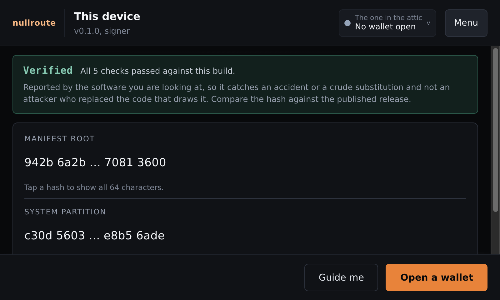

# nullroute

[](https://github.com/Xaxis/nullroute/actions/workflows/ci.yml)
[](LICENSE)
[](packages/verify)
[](docs/THREAT-MODEL.md)

An air-gapped Bitcoin signing device you can check rather than trust. You roll
100 dice, it turns them into a seed by a rule you can repeat with `sha256sum`,
and it refuses to start unless its own code matches a published hash.

> **Pre-1.0 and unaudited, with hardware bring-up on the Raspberry Pi 4 next.
> Keep real money off it until both are done.** See [Status](#status).



## Run it in three commands

You do not need a Raspberry Pi. The whole device runs on a Mac or a Linux box.
**Needs Node 24.**

```bash
git clone git@github.com:Xaxis/nullroute.git && cd nullroute
make install
make dev
```

That builds everything, runs the verification system, and opens the device at
<http://127.0.0.1:5180>. It refuses to start if the code and the specifications
disagree, which is the same refusal the real device makes at boot.

**Try this first.** Press **Unlock**, pick **Signet** so nothing is real, and
roll some dice. Watch the entropy counter. Then enter the same digit a hundred
times and read what it says.

Ctrl-C stops it. `make restart` if a previous run is still holding the port,
`make restart FRESH=1` to erase the local wallets first. Your wallet lives in
`.nullroute-store/` and your laptop is not a signing device: treat anything you
make here as a toy.

## Build a card

Needs Docker, and builds for arm64.

```bash
make image             # a flashable card and its checksums
make image-boot-test   # boot it, then boot a copy with one byte changed
make image-repro       # build it twice and check the two agree
```

`make image-boot-test` is the one worth watching. It boots the card, opens the
dm-verity mapping, mounts the root through it, reads every block, starts the
signing daemon, and then does the same to a corrupted copy and requires that
boot to fail. A device that cannot tell those apart has an integrity check for
decoration.

Flashing, and what should appear on the console, is in
[docs/INSTALL.md](docs/INSTALL.md). **Use a spare card.** The firmware path from
power-on to the kernel is carried on the image and has never been executed on a
Pi.

## Check it yourself

Every step here uses tools that are not ours. This is the part that makes
nullroute different, so it is worth doing once.

```console
$ sha256sum -c MANIFEST.lock   # every source file matches
$ sha256sum MANIFEST.lock      # the number the device shows at boot
```

What you computed and what the lock screen shows should agree. A published
release hash will make it three; nothing has been released yet.

**Check the seed rule by hand.** Dice become a seed by SHA-256 of the ASCII roll
string with no trailing newline. `printf`, not `echo`:

```console
$ printf '%s' '1234561234561234561234561234561234561234561234561234561234561234561234561234561234561234561234561234' | sha256sum
e56403e8522ddeae1b44a1e8148b1ba4d3b4c626ccf20980056eedcc7e0c0f35  -
```

If your device shows something else for the same rolls, it is lying to you. That
is 100 rolls exactly, not 99: 99 rolls is 255.911 bits, which is short of 256.
On macOS use `shasum -a 256`.

**Check a signature.** Signatures are deterministic (RFC 6979, and BIP-340 with
`aux_rand` fixed to zero), so the same key and transaction always produce
identical bytes and anyone with the seed can recompute them. There is no room in
a deterministic signature to hide a leaked key.

**Check you do not need us.** Take the mnemonic and descriptor to Bitcoin Core
and confirm it sees the same addresses. `make test-recovery-drill` runs that
against a real regtest Core for all four address types and a 2-of-3 quorum. If
it ever fails, that is a security report.

The full procedure, written for someone who does not trust this project, is in
[docs/VERIFICATION.md](docs/VERIFICATION.md).

## What you need to build one

Roughly $100 to $120.

| Part | What to get | Notes |
| --- | --- | --- |
| Board | Raspberry Pi 4 (4GB) | The only board this image supports, and the only device tree on the card. |
| Screen | Official Raspberry Pi 7 inch touchscreen | The DSI panel. Every screen is measured at exactly 800x480 and no other size. |
| Storage | 16GB+ A2 SD card | The image is about 1.6GB. |
| Dice | One d6 | Casino grade if you care. Any die works. |
| Camera | Pi Camera Module 3 | How transactions reach the device today. Without one it can still show codes, but receives nothing: an SD card transport is planned and not built. |
| Case, PSU | Anything, official PSU | An underpowered supply causes strange slowness. |

You do **not** need a network connection on the device, ever. That is the point.

## What it does not do

Read [docs/THREAT-MODEL.md](docs/THREAT-MODEL.md) before trusting this with
anything. The headlines:

**No secure element.** Your keys are encrypted with a key derived from your PIN
and that is the entire physical defence. Someone holding your SD card is limited
only by how good your PIN is. A Coldcard or a BitBox02 is genuinely better on
this specific point, which is exactly why the recommended setup puts one of them
next to nullroute in a quorum.

**One signer, not your whole wallet.** Designed for 2-of-3 or 3-of-5 alongside
other vendors' hardware.

**Duress features are planned, not built.** Hidden profiles and a wipe PIN are
phase 7 and no part of either exists today. When built, they buy time against
someone unsophisticated and nothing more, because this code is public and anyone
who has read it knows they exist. Under real threat, give them the money.

**Also out of scope:** side channel attacks, sophisticated physical attacks on
the chip, evil maid attacks without secure boot, and a backdoored OS image
flashed before you ever started.

**Deliberately absent:** price display, fiat conversion, Lightning, coinjoin,
and anything involving a cloud.

## Status

**Phases 1 through 4 complete.**

| Phase | Scope | State |
| --- | --- | --- |
| 1 | Spec system, entropy, BIP-39/32, daemon, lock screen, networks | **Complete** |
| 2 | Descriptors, addresses, PSBT review, signing. Provisioning tier 0. | **Complete**, except tier 0 signing and publishing, which are planned |
| 3 | Encrypted store, passphrase, multisig, cosigner registration, tier 1 boot attestation | **Complete** |
| 4 | BIP-322 message signing, BIP-85 child seeds, BIP-329 labels | **Complete** |
| 5 | Wallet layer, optional and lower assurance | Not started |
| 6 | Bridge companion, runs on a networked machine | Not started |
| 7 | Miniscript, taproot script paths, SeedXOR. Tier 2. | Not started |

**Working today.** Dice entropy end to end, BIP-39 and BIP-32 against the
official vectors, all four address types, BIP-85 child seeds. Descriptor parsing
with BIP-380 checksums, PSBT review and deterministic signing cross-checked
against libsecp256k1. Multisig with cosigner registration that refuses a quorum
this device holds no key in. An encrypted store, several named wallets, backup
and restore, BIP-329 labels beside the outputs you read before signing, and a
ten minute idle lock. BIP-322 proofs, and checking somebody else's with the
wallet locked.

**The card boots.** Under QEMU: dm-verity opens, the root mounts through it,
every block verifies, systemd starts, the state partition is created, and the
signing daemon attests itself and listens. A copy with one byte changed is
refused. The lock screen shows two numbers now: the manifest root, which attests
the application, and the dm-verity root hash the running kernel is checking every
block of the root filesystem against, read from the live device-mapper table
rather than from the card. The image is judged against a profile of assertions
rather than a recipe, and twenty-one of the twenty-one verifiers are written.
The last
three answer questions no artifact at rest can: mount flags in force, swap in
use, sockets listening. Reading those from an unbooted image is a confident
false pass, so instead the booted guest prints the kernel's own files to its
console and the verdict is reached on the host, against the profile. The image
does not grade itself.

**What is next: hardware bring-up.** The card boots under QEMU today, and the
first boot on a Pi 4 with the 7 inch panel is the next milestone. That boot is
what exercises the firmware path from power-on to the kernel, which is built and
on the card, and what gives the kiosk browser its first display:
`make image-boot-test` reports that component rather than judging it, because
an emulator with no virtual terminal cannot. Tier 1 boot attestation is built
and proven under QEMU. Signing and publishing images come after bring-up.

**Not for funds yet.** It needs somebody other than the author to read the
cryptography, and a finished hardware bring-up, first.

## Documentation

Rendered at [nullroute.diy](https://nullroute.diy) from these exact files.

| Document | Answers |
| --- | --- |
| [Installing it](docs/INSTALL.md) | How do I build, flash and boot a card? |
| [Threat model](docs/THREAT-MODEL.md) | What is this safe against, and what is it not? |
| [Checking and building](docs/VERIFICATION.md) | How do I check the device is honest? |
| [Using it](docs/USING.md) | What are the screens, and what does each one refuse? |
| [Entropy](docs/ENTROPY.md) | How do dice become a seed, and how do I check it? |

## Repository layout

```
packages/core      Crypto and Bitcoin logic. Pure, no I/O, runs in a browser too.
packages/daemon    Holds the keys. Unix socket only. Refuses to start unverified.
packages/ui        The device screens
packages/verify    The tool that checks code, specs and tests agree
provisioning/      Hardening profiles, as assertions with verifiers
spec/              Machine-readable spec schema and official BIP test vectors
docs/              The documents above. A deliverable, not an afterthought.
apps/web/          nullroute.diy. Never ships to the device.
```

`make` on its own lists every target. `make check` runs most of what CI runs.
It leaves out the recovery drill (`make test-recovery-drill`, which needs a
regtest `bitcoind`) and the image build, which CI runs as separate jobs.

## Contributing

Read [CONTRIBUTING.md](CONTRIBUTING.md). The rules that will surprise you: no new
dependency without sign-off, no feature without a passing spec, no network
capability anywhere in `packages/`, and no em dashes.

Security issues go through [SECURITY.md](SECURITY.md), never the public issue
tracker.

## Licence

MIT. See [LICENSE](LICENSE). It is the Bitcoin ecosystem's norm and its
attribution requirement keeps provenance traceable when security code gets
vendored into something else.
